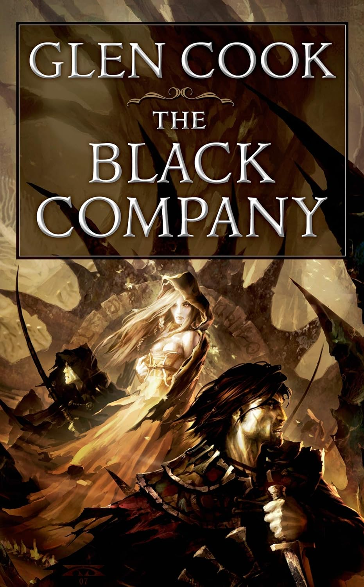
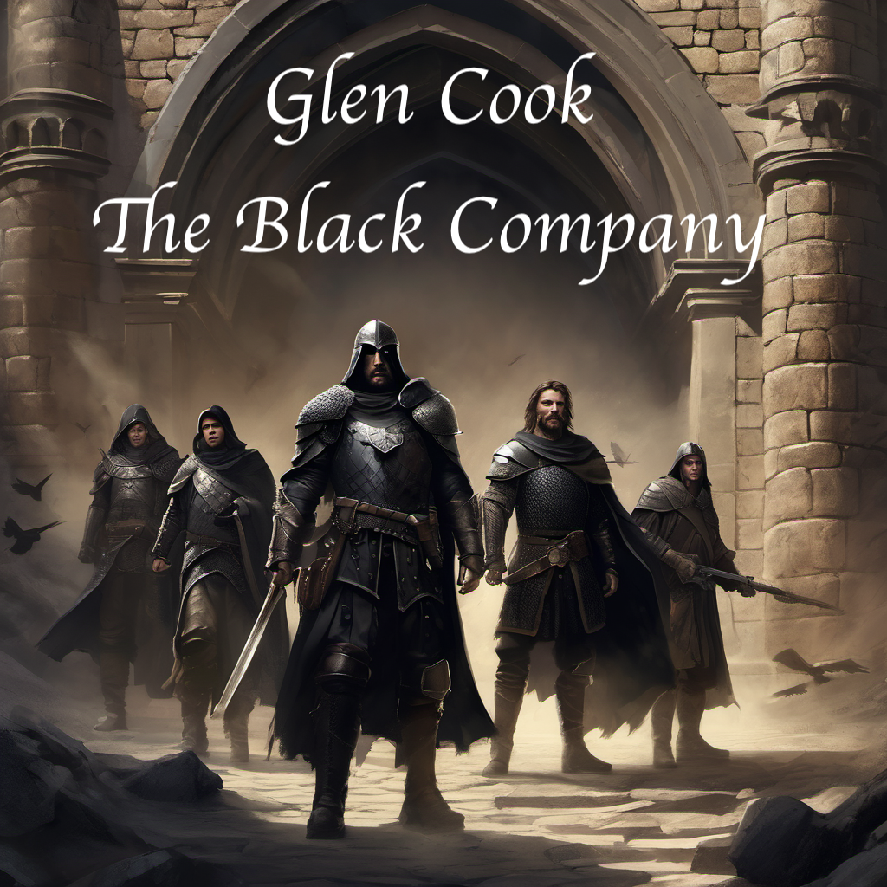
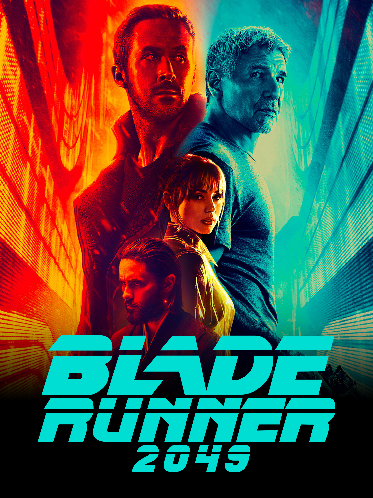
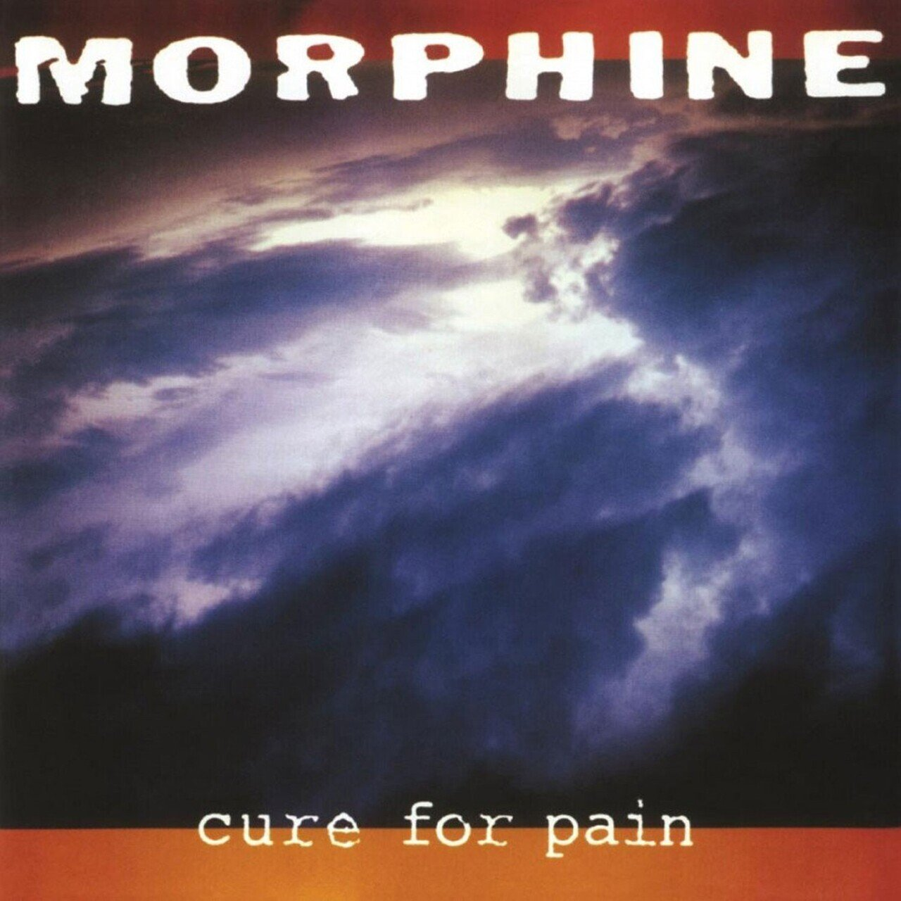

# Capstone Project  
## Self-Hosted Image Generation for Alternative Cover Art
*(Book · Film · Vinyl Album)*
**Platform:** RunPod + ComfyUI (SDXL)  
**Author:** Oleksii Obolonskyi  
---

## 1. Project Summary

This capstone project presents a **self-hosted AI image generation system** built on **RunPod** using **ComfyUI** and **Stable Diffusion XL (SDXL)**.  
The system was designed to generate **alternative cover artwork** for three media formats:

- **Book** – *The Black Company* by Glen Cook  
- **Film** – *Blade Runner 2049*  
- **Vinyl Album** – *Morphine – Cure for Pain*

The project emphasizes:
- Reproducible workflows
- Prompt engineering
- Operational reliability on ephemeral GPU infrastructure
- Professional artifact export (images + workflows)

---

## 2. Platform & Architecture

### 2.1 Infrastructure

- **Cloud Provider:** RunPod
- **GPU:** NVIDIA RTX-class GPU
- **Runtime Image:** Predefined RunPod ComfyUI image
- **Interface:** ComfyUI Web UI + File Browser
- **Storage:** Persistent workspace volume

### 2.2 Rationale for Predefined Pod Configuration

A **prebuilt RunPod configuration** was chosen to:
- Avoid CUDA / driver mismatches
- Reduce setup and debugging time
- Allow rapid pod recreation or migration

**Example:**  
When the GPU became unavailable after a pod pause, a new pod was created and data migrated immediately without reconfiguration.

---

## 3. Models & Tools

### 3.1 Image Generation Model

- **Model Name:** Stable Diffusion XL Base 1.0  
- **Refiner:** SDXL Refiner 1.0 (where applicable)  
- **Format:** `.safetensors`  
- **Source:** https://huggingface.co/stabilityai  

### 3.2 Extensions / Add-ons

- **ComfyUI Manager**
- **Real-ESRGAN** (for upscaling, optional)
- **No LoRAs used** (baseline SDXL only)

---

## 4. Technical Generation Parameters

Common parameters across workflows:

| Parameter | Value |
|---------|------|
| Resolution | 512×512 (initial) |
| Sampler | DPM++ 2M |
| Scheduler | Karras |
| Steps | 20–30 |
| CFG Scale | 7–8 |
| Seed | Random |
| Batch Size | 1 |

---

## 5. Workflows

Each media type uses a dedicated ComfyUI workflow:

- `workflows/Capstone_2.2(book).json`
- `workflows/Capstone_2.2(film).json`
- `workflows/Capstone_2.2(vinyl).json`

### Core Pipeline Structure

1. Load Checkpoint (SDXL)
2. CLIP Text Encode (Positive Prompt)
3. CLIP Text Encode (Negative Prompt)
4. Empty Latent Image
5. KSampler
6. VAE Decode / VAE Decode (Tiled)
7. Save Image

---

## 6. Book Cover Generation

### Source & Concept
- **Original reference:** Classic fantasy cover aesthetics
- **Goal:** Dark, grounded, militaristic fantasy tone

### Result Comparison

| Original Reference | Final Generated |
|--------------------|-----------------|
|  |  |

---

## 7. Film Cover Generation

### Source & Concept
- **Original reference:** Blade Runner 2049
- **Goal:** Neon-noir, dystopian, cinematic composition

### Result Comparison

| Original Reference | Final Generated |
|--------------------|-----------------|
|  |  |

---

## 8. Vinyl Cover Generation

### Source & Concept
- **Original reference:** Morphine – *Cure for Pain*
- **Goal:** Minimalist, moody, atmospheric album art

### Result Comparison

| Original Reference | Final Generated |
|--------------------|-----------------|
|  |  |

---

## 9. Prompt Engineering Strategy

### Positive Prompt Principles
- Clear subject definition
- Mood and lighting first
- Medium-specific keywords (book cover, film poster, album art)

### Negative Prompt Principles
- Explicit anatomical constraints
- Removal of visual artifacts
- Suppression of unwanted text or watermarks

Example categories used in negative prompts:
- Extra limbs
- Deformed anatomy
- Merged bodies
- Unrealistic proportions

---

## 10. RunPod Screenshots & Logs

Captured during setup and execution:

- `runpod_screens/comfyui_manager.png`
- `runpod_screens/load_model.png`
- `runpod_screens/output_files.png`
- `runpod_screens/runpod_workflow.png`
- `runpod_screens/runpod_logs.png`
- `runpod_screens/runpod_telemetry.png`
- `runpod_screens/ksampler_config.png`
- `runpod_screens/pipeline_after_execution.png`

These screenshots document configuration, execution, and results.

---

## 11. Troubleshooting & Lessons Learned

### 11.1 Choosing a Predefined Pod Configuration

**Issue:** Risk of environment instability with custom builds  
**Solution:** Use a maintained RunPod image  
**Outcome:** Faster recovery, lower maintenance overhead

---

### 11.2 KSampler Runtime Errors

**Issue:** Initial failures during sampling  
**Root Cause:**
- Aggressive parameters
- Sampler/scheduler mismatch

**Solution:**
- Switched to **DPM++ 2M + Karras**
- Reduced resolution during debugging
- Verified latent and conditioning connections

**Outcome:** Stable image generation

---

### 11.3 GPU Unavailability After Pod Pause

**Issue:** “Your pod’s GPUs are no longer available”  
**Observation:** Waiting provided no benefit

**Solution:**
- Migrated to a new pod immediately
- Reused persistent storage

**Outcome:** Zero data loss, minimal downtime

---

### 11.4 Fixing Deformed Human Figures

**Issue:** Extremely tall characters, extra limbs  
**Root Cause:** Overloaded prompts and missing constraints

**Solution:**
- Refined negative prompts
- Reduced prompt redundancy
- Balanced CFG values

**Outcome:** Realistic proportions and cleaner compositions

---

## 12. Final Outcome

- Fully self-hosted AI image generation pipeline
- Three distinct, high-quality alternative covers
- Reproducible workflows
- Clear operational and troubleshooting strategy

This project demonstrates a production-ready approach to AI-assisted creative generation using cloud GPU infrastructure.

---